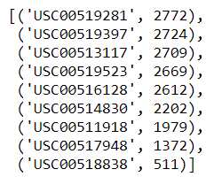
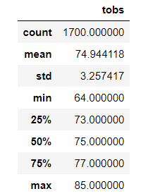
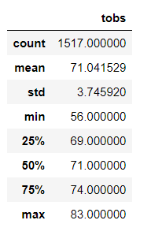

# Surfs Up Statistical Analysis

# Overview of the Analysis
Purpose of this report is to identify Oahu temperature trends for June and December.  The analysis will help determine if the weather will be conducive to having sustainable year-round income.

# Results
The analysis entailed using temperature data from January 2010 through December 2017.  The temperature data was captured from nine different weather stations.  See list below list for station and associated activity.

From the entire station data, temperatures for June, for all years, were analyzed.  See below table for the statistics for June.

The same analysis was performed on all the December temperatures.  See table below for the statistics for December.

The statistics from both time periods were then compared.  The primary differences are shown below.

* Finding 1. There is a difference of 183 less data points in December than June.

* Finding 2. The largest difference in temperature was in the minimum temperature statistic - a difference in 8 degrees cooler in December than in June.

* Finding 3. The standard deviation for both time periods were very close - a difference of less than 0.5 degree.

# Summary
Based on the statistics for June and for December, there is very little variation in the temperature, when the entire island is taken as a whole.  However, given the island of Oahu has micro-climates, additional analysis needs to be performed on a station level.  Ideally, select the station nearest the potential store location.  By doing so, the information gleaned will offer more accurate temperature trends for that part of the island.  

Additional analysis is recommended taking into account both station location and precipitation.  Because although the temperature is warm, it could still be raining.   

##### Additional Query 1
Identify station ID nearest the future location of the surf shop.  Using that station ID as the filter, perform statistical analysis of the temperature covering all years.

##### Additional Query 2
Building on query 1, add in the precipitation data.  By including precipitation information, the information returned will give the investor a clearer picture of the weather conditions.

